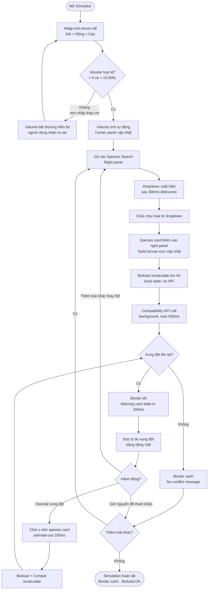
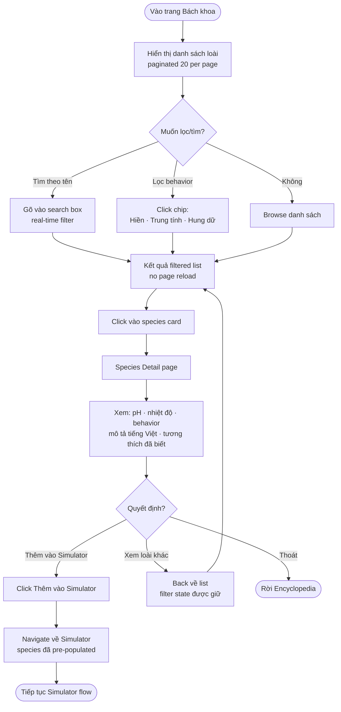
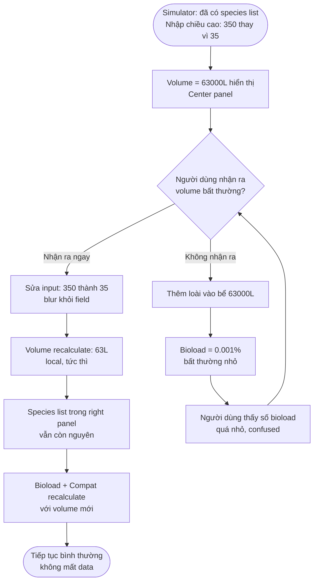
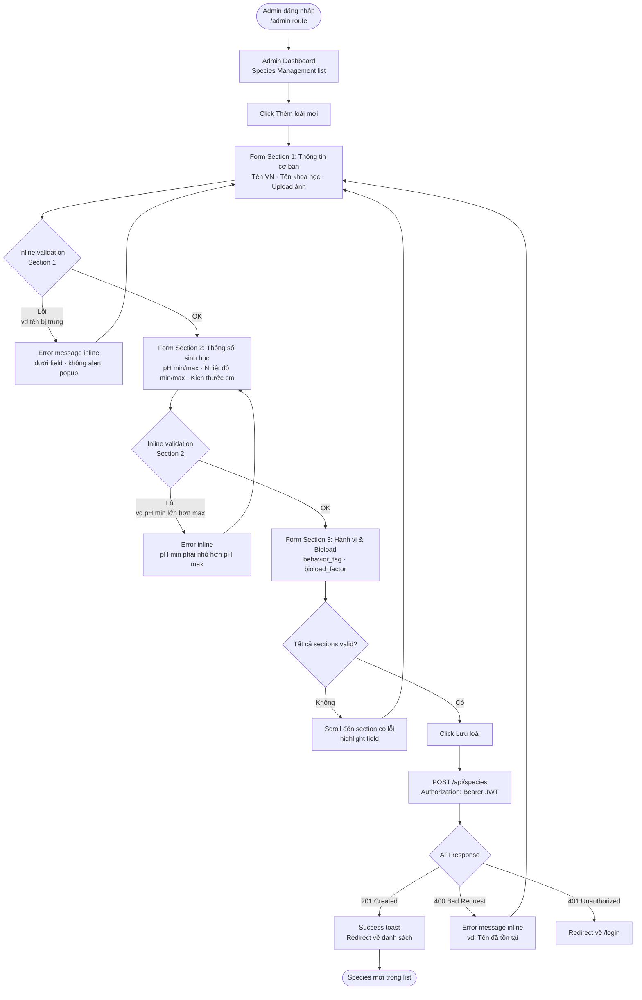

---
stepsCompleted:
  - step-01-init
  - step-02-discovery
  - step-03-core-experience
  - step-04-emotional-response
  - step-05-inspiration
  - step-06-design-system
  - step-07-defining-experience
  - step-08-visual-foundation
  - step-09-design-directions
  - step-10-user-journeys
  - step-11-component-strategy
  - step-12-ux-patterns
  - step-13-responsive-accessibility
  - step-14-complete
status: 'complete'
completedAt: '2026-05-15'
inputDocuments:
  - _bmad-output/planning-artifacts/prd.md
  - _bmad-output/planning-artifacts/architecture.md
  - _bmad-output/planning-artifacts/epics.md
project_name: 'aquawiki'
user_name: 'Huylaiphu3'
date: '2026-05-15'
---

# UX Design Specification - AquaWiki

**Author:** Huylaiphu3
**Date:** 2026-05-15

---

<!-- UX design content will be appended sequentially through collaborative workflow steps -->

## Executive Summary

### Project Vision

AquaWiki is a decision-support tool, not an encyclopedia. The core UX differentiator is timing: the system intervenes BEFORE a user purchases incompatible fish, not after. Every UX decision serves one goal — deliver the first compatibility warning as fast as possible, without requiring a tutorial. The "aha moment" occurs when a red warning appears the instant an incompatible species is added to the simulator. This prevention-first feedback loop (Green → Red → Adjust → Green) is the product's core UX value.

### Target Users

**Minh — The Bewildered Beginner (Primary)**
Age 22, buys fish by appearance with no compatibility knowledge. Needs: warnings in clear Vietnamese, a self-explaining interface with zero learning curve, and recovery from mistakes (wrong unit entry) without losing progress. Success = first compatibility warning received within 2 minutes, no documentation read.

**Lan — The Deliberate Planner (Power User)**
Age 30, 5 years experience, simulates multiple tank configurations before spending money. Needs: fast workflow, ability to compare configs, bioload precision. Success = can run 3 different simulations in one evening session.

**Hùng — The Edge Case**
Enters dimensions in mm instead of cm (gets 63,000L instead of 63L). Needs: graceful recovery — correcting the value recalculates immediately without losing the species list already added. Success = no data loss, no page reload needed.

**Tuấn — The Content Admin**
Manages species database, fills complex forms with 10+ required fields per species. Needs: logical field grouping, inline validation, efficient compatibility exception management. Success = new species entry completed accurately in one session.

### Key Design Challenges

1. **Zero-friction onboarding in 2 minutes** — The Simulator must be intuitive enough for Minh to discover independently. The input sequence (tank dimensions → add species → see warning) must feel as natural as filling a form. No tutorial, no tooltips required.

2. **Real-time feedback loop without perceptible lag** — The "aha moment" breaks if the warning appears with delay. Any latency > 0.5s disrupts the cause-and-effect relationship between adding a species and seeing the consequence. Debounced API calls (300ms) require explicit loading states to maintain perceived responsiveness.

3. **Warning messages readable by beginners, not condescending to experts** — Warnings need a *why* (territorial behavior, fin shape similarity) not just a severity label. Vietnamese copy must feel native, not machine-translated. "Betta + Guppy: RỦI RO CAO — Betta có tính lãnh thổ với các loài cá có vây dài" is the target register.

4. **2D visualization meaningful within strict constraints** — Rectangle canvas + species icons + colored border, max 10 icons, mobile 375px viewport. The visualization must communicate tank state at a glance rather than serve as decoration.

5. **Admin form cognitive load** — Species creation requires 10+ mandatory fields (pH range, temperature range, behavior tag, max size, bioload factor, etc.). Form design must group fields logically, validate inline, and reduce the sense of overwhelming complexity.

### Design Opportunities

1. **Prevention-first feedback loop as satisfying UX** — The Green → Red → Remove → Green cycle can be genuinely satisfying if designed well — similar to solving a puzzle. Micro-transitions on border color change and warning fade-in/out can reinforce the cause-and-effect feeling.

2. **Vietnamese tone of voice as competitive advantage** — As the first Vietnamese-language tool in this domain, there is an opportunity to establish a voice that feels genuinely local. Warning messages, empty states, and helper text written in natural Vietnamese (not translated English) create trust with the target audience.

3. **Progressive complexity by user type** — Beginners live in the Simulator. Power users explore the Encyclopedia. Admins have their own panel. Each user type has a natural "home base" without being overwhelmed by features meant for other types. Navigation should surface the right entry point for each user.

4. **Mobile-first Simulator** — Vietnamese users are predominantly mobile. Making the Simulator thumb-friendly on 375px — with appropriately sized touch targets, a readable TankCanvas, and a compact species selector — could be the primary usage context, not a degraded fallback.

## Core User Experience

### Defining Experience

The ONE interaction that defines AquaWiki's entire value: a user adds a species to the simulator and immediately sees a red warning appear — understanding what they're about to do wrong before making the mistake. Every other feature (Encyclopedia, Bioload, 2D Visualization, Admin) exists to support this central moment. If this interaction fails, the product fails.

### Platform Strategy

- **Platform:** Web SPA (React, no SSR, no mobile app in MVP scope)
- **Primary context:** Desktop browser (Chrome/Firefox/Edge) — keyboard input for data entry
- **Secondary context:** Mobile 375px — users browse species on their phone before visiting a fish store
- **Input modalities:** Mouse + keyboard (desktop), touch (mobile) — both must support core flows
- **Offline:** Not required — portfolio SPA scope

### Effortless Interactions

Three interactions must feel like "zero thought":

1. **Adding a species to the simulator** — type 2 characters → see results → click. No navigation away from the simulator, no need to know scientific names.

2. **Seeing compatibility results** — automatic after adding a species; no "Check Compatibility" button to press. Feedback arrives without being requested.

3. **Reading and understanding a warning** — no domain knowledge required to understand "Betta + Guppy: RỦI RO CAO — Betta cắn cá có vây dài". Plain language, Vietnamese, zero jargon.

### Critical Success Moments

**Moment 1 — First Warning (Make-or-break):**
User adds the first species that causes a conflict. Border turns red, warning appears. If this does not happen within 2 minutes of opening the app, the user bounces and does not return.

**Moment 2 — Resolution Loop:**
User removes the conflicting species → warning disappears → border turns green. This cycle is rewarding — it feels like solving a problem. The transition must be smooth, not jarring.

**Moment 3 — Understanding Why:**
User reads the plain-language explanation and understands the biological reason. "Ah, Betta sees long-finned fish as territorial rivals." At this moment the product teaches, not just warns.

**Moment 4 — First Successful Simulation (All Green):**
User finds a combination with no conflicts. Bioload healthy. Border green. Feeling of having "solved" the tank planning puzzle — this is the success state.

### Experience Principles

1. **Consequence is immediate** — Every action has visible feedback instantly. Add a species → warning updates. Change dimensions → bioload recalculates. No action ends in silence.

2. **Warning is the feature** — A red warning is not an error state — it is the product working correctly. Red must be designed to feel helpful, not threatening. Copy framed as "we're helping you avoid a mistake" not "you did something wrong."

3. **Vietnamese by default** — Not translated from English. All UI copy, warnings, and empty states written in Vietnamese from the start. Tone: a knowledgeable friend, not a chatbot.

4. **Progressive revelation** — Simulator is the entry point for beginners. Encyclopedia holds depth for power users. Admin panel is completely invisible to regular users. No feature overload — each user type sees only what they need.

5. **Recover without penalty** — Mistakes don't erase work. Enter mm instead of cm → correct it → previously added species remain. Remove a species accidentally → re-add from selector immediately. No "you lost your data" states.

## Desired Emotional Response

### Primary Emotional Goals

AquaWiki có ba mục tiêu cảm xúc cốt lõi, theo thứ tự ưu tiên:

1. **Empowered (Tự tin làm chủ)** — Người dùng cảm thấy mình có đủ thông tin để quyết định, dù không phải chuyên gia. Minh — người mua cá theo vẻ ngoài — sau khi dùng AquaWiki phải cảm thấy "mình hiểu điều mình đang làm", không phải "may mắn không mua nhầm."

2. **Relief (Nhẹ nhõm vì đã tránh được sai lầm)** — Cảm giác cốt lõi là ngăn chặn, không phải phát hiện. Khi cảnh báo đỏ xuất hiện TRƯỚC khi mua, người dùng cảm thấy hệ thống đang đứng về phía họ — một người bạn hiểu biết đang kéo họ lại đúng lúc.

3. **Satisfaction (Thỏa mãn khi "giải được bài toán")** — Vòng lặp Green → Red → Remove → Green phải cảm giác như giải một câu đố nhỏ. Trạng thái "tất cả xanh, bioload ổn" là phần thưởng cảm xúc cho buổi lên kế hoạch.

### Emotional Journey Mapping

| Giai đoạn | Cảm xúc mong muốn | Cảm xúc cần tránh |
|---|---|---|
| **Khám phá lần đầu** (mở app, thấy Simulator) | Tò mò + Dễ tiếp cận — "Ồ, đơn giản vậy thôi" | Lo lắng, choáng ngợp |
| **Nhập thông số bể** (L × W × H) | Tập trung + Tự nhiên — như điền form đơn giản | Bối rối về đơn vị |
| **Thêm loài đầu tiên** | Háo hức + Hồi hộp chờ kết quả | Mơ hồ — "Không biết chuyện gì xảy ra tiếp theo" |
| **Khoảnh khắc cảnh báo đỏ đầu tiên** (Make-or-break) | Ngạc nhiên → Hiểu → Trao quyền — "À, ra vậy!" | Bị chỉ trích, xấu hổ vì "làm sai" |
| **Đọc giải thích cảnh báo** | Tin tưởng + Hiểu biết — lý do sinh học rõ ràng | Nghi ngờ, không tin dữ liệu |
| **Xóa loài xung đột, bể chuyển xanh** | Nhẹ nhõm + Thỏa mãn — "Mình sửa được rồi" | Thất vọng, cảm giác mất thời gian |
| **Tất cả xanh, simulation hoàn tất** | Tự hào + Thành tựu — "Kế hoạch bể của mình ổn rồi" | Không chắc chắn — "Vậy đủ rồi chưa?" |
| **Nhập sai đơn vị (mm thay cm), sửa lại** | Bình tĩnh + Tin tưởng — danh sách loài vẫn còn đó | Tức giận vì mất data, phải làm lại |
| **Quay lại lần tiếp theo** (Lan — Power User) | Quen thuộc + Hiệu quả — biết ngay phải làm gì | Chán nản vì phải học lại |

### Micro-Emotions

Sáu cặp micro-emotion và trạng thái mục tiêu:

- **Confidence over Confusion** — Người dùng biết ngay bước tiếp theo sau mỗi action. Cảnh báo đủ rõ để hành động ngay, không cần đọc thêm tài liệu.

- **Trust over Skepticism** — Giải thích bằng tiếng Việt tự nhiên + lý do sinh học cụ thể ("Betta có tính lãnh thổ với loài có vây dài") tạo tin cậy. Không phải label chung chung "NGUY HIỂM."

- **Curiosity over Anxiety** — Thêm loài vào bể nên cảm giác như khám phá, không phải đi qua bãi mìn. Hệ thống dẫn dắt, không phán xét.

- **Accomplishment over Frustration** — Mỗi conflict được resolve là một thành tựu nhỏ. Transition animation khi border chuyển xanh là phần thưởng tức thì.

- **Delight at Key Moments** — Ba khoảnh khắc delight có chủ đích: (1) lần đầu thấy cảnh báo xuất hiện tức thì khi thêm loài — "wow nhanh thật"; (2) border chuyển xanh mượt mà sau khi resolve; (3) bioload indicator nhảy số khi thay đổi thông số bể.

- **Belonging over Isolation** — Tiếng Việt bản địa tạo cảm giác "tool này được làm cho mình", không phải dịch máy từ tool nước ngoài.

### Design Implications

| Cảm xúc mục tiêu | Quyết định UX cụ thể |
|---|---|
| **Empowered** | Cảnh báo luôn kèm WHY (lý do sinh học), không chỉ severity label. Người dùng hiểu, không chỉ được báo. |
| **Relief** | Warning xuất hiện tự động — không cần bấm "Kiểm tra". Timing là tất cả: < 500ms sau khi thêm loài. |
| **Satisfaction (resolution loop)** | Smooth CSS transition khi border đổi màu (300ms ease). Warning fade-out khi conflict được xóa, không biến mất đột ngột. |
| **Trust** | Copy cảnh báo viết tiếng Việt bản địa. Câu ngắn, trực tiếp. Tránh technical jargon. |
| **Confidence** | Tank state (bioload, conflict count) luôn hiển thị — không có hidden state. Người dùng không cần đoán. |
| **Calm recovery** | Sửa đơn vị (mm → cm) không xóa species list. Live recalculation khi blur khỏi input field. Không có "Submit" button gây mất data. |
| **Curiosity** | Empty state Simulator không để trắng — có prompt thân thiện: "Thêm loài đầu tiên của bạn" với gợi ý tìm kiếm. |
| **Belonging** | Không có UI nào bằng tiếng Anh khi sử dụng ở chế độ thông thường. Language là tính năng, không phải localization. |

### Emotional Design Principles

1. **Cảnh báo là quà tặng, không phải hình phạt** — Copy và visual design của warning state phải truyền thông điệp "hệ thống đang giúp bạn tránh sai lầm", không phải "bạn đã làm sai." Red là màu của sự chú ý, không phải màu của lỗi. Framing: "Betta + Guppy có thể xung đột" thay vì "Bạn đã chọn sai."

2. **Mỗi action phải có echo cảm xúc** — Silence sau một action là UX failure. Thêm loài → species card xuất hiện + bioload cập nhật + compatibility check chạy (loading indicator nếu > 300ms). Người dùng luôn biết hệ thống đang phản hồi.

3. **Progression phải cảm giác được** — Người dùng phải cảm nhận được tiến trình từ "bể trống" đến "kế hoạch hoàn chỉnh." Bioload bar filling up, species cards accumulating, border staying green — đây là visual metaphor của sự tiến bộ.

4. **Recover without penalty = recover without shame** — Không có thông báo lỗi nào nên dùng từ "sai", "lỗi", "không hợp lệ" với người dùng thông thường. Thay vào đó: gợi ý, correction prompt, automatic recalculation.

5. **Delight qua precision, không qua decoration** — Micro-delight đến từ hệ thống hoạt động chính xác và nhanh, không phải từ animation phức tạp. Một bioload number cập nhật tức thì khi nhập chiều cao bể — đó là delight thực sự.

## UX Pattern Analysis & Inspiration

### Inspiring Products Analysis

#### 1. AqAdvisor (Direct Competitor — Phân tích để học từ thất bại)

AqAdvisor là công cụ tương thích cá gần nhất với AquaWiki, nhưng thất bại ở nhiều điểm UX:

- **Form-submit-then-check workflow**: Người dùng phải nhập hết thông tin, bấm Submit, rồi mới thấy kết quả — phá vỡ cause-and-effect loop
- **Tiếng Anh toàn bộ**: Không phục vụ được thị trường Việt Nam, cảm giác tool ngoại lai
- **Kết quả dạng text wall**: Compatibility results là đoạn văn dài, không có visual hierarchy, không scannable
- **Không có 2D visualization**: Người dùng phải tưởng tượng, không nhìn thấy "bể" của mình
- **Mất state khi sửa lỗi**: Điều chỉnh thông số bể buộc phải nhập lại toàn bộ
- **Bài học**: AquaWiki phải làm ngược lại AqAdvisor trên mọi điểm này

#### 2. Duolingo (Feedback Loop & Error Framing)

Duolingo giải quyết bài toán cực kỳ tương tự AquaWiki: dạy người dùng điều gì đó họ không biết mà không làm họ cảm thấy ngu ngốc.

- **Immediate feedback**: Câu trả lời đúng/sai xuất hiện ngay sau khi chọn — không có loading screen, không có "Submit form"
- **Non-judgmental error handling**: Sai vẫn có animation dễ chịu, text "Almost! Here's the correction" thay vì "WRONG"
- **Progress visible at all times**: Thanh progress bar luôn hiển thị — người dùng biết mình đang ở đâu
- **Completion state**: Hoàn thành một bài học có ceremony rõ ràng — màn hình celebration, không chỉ redirect sang trang mới
- **Bài học áp dụng**: Warning framing ("Betta có thể xung đột" = cơ hội học, không phải lỗi), border xanh cuối phiên = Duolingo completion state

#### 3. Shopee Search (Instant Search Pattern)

Shopee là app thương mại điện tử phổ biến nhất Việt Nam — target users của AquaWiki đều quen với Shopee search UX:

- **Search-as-you-type**: Gõ 2-3 ký tự là thấy gợi ý ngay, không cần bấm Enter hay Search
- **Product cards**: Mỗi kết quả tìm kiếm có ảnh + tên + giá — scannable trong 0.5 giây
- **Lọc không cần form**: Filter bằng chip/tag, không phải dropdown form phức tạp
- **Bài học áp dụng**: Species search phải hoạt động như Shopee search — type 2 ký tự → thấy species suggestions ngay. Species card: ảnh + tên tiếng Việt + behavior tag chip

#### 4. Google Maps Search (Autocomplete Mental Model)

Vietnamese users có mental model rất mạnh về Google Maps autocomplete:

- **Predictive completion**: Không cần gõ đúng hoàn toàn — "bet" gợi ý "Betta Splendens" ngay
- **Results appear in place**: Kết quả xuất hiện ngay trong search box, không điều hướng sang trang khác
- **Dismiss to continue**: Chọn xong kết quả, search UI tự collapse, người dùng quay lại main flow
- **Bài học áp dụng**: Species search dropdown trong Simulator phải feel như Maps autocomplete — không mở trang riêng, không mất context, chọn xong tự đóng

### Transferable UX Patterns

**Navigation Patterns:**

- **Single-page Simulator** (từ Shopee product page) — Tất cả actions xảy ra trên một màn hình: nhập bể, tìm loài, thấy kết quả. Không navigate ra ngoài và mất trạng thái.
- **Sticky state header** (từ Shopee cart icon) — Tank summary (volume, bioload %, conflict count) luôn visible trên đầu trang khi scroll — người dùng không bao giờ mất context.

**Interaction Patterns:**

- **Debounced search-as-you-type** (từ Shopee/Maps) — Species search trigger sau 300ms không gõ. Users không cần bấm Search. Mental model: "gõ là thấy."
- **Inline add, không modal** (từ Duolingo word selection) — Thêm species bằng click vào card trong dropdown, không mở dialog/modal. Giảm bước, giảm friction.
- **Live recalculation trên blur** (từ Google Sheets) — Bioload và compatibility recalculate ngay khi người dùng rời khỏi input field. Không cần "Apply" hay "Recalculate" button.
- **Card-based species list** (từ Shopee product list) — Mỗi species trong tank là một card với remove button. Scannable, không phải text list.

**Visual Patterns:**

- **Traffic light color system** (universal, từ Google Maps traffic layer) — Green/Yellow/Red border trên TankCanvas là ngôn ngữ visual đã được users hiểu từ trước. Zero learning curve.
- **Progress bar cho bioload** (từ Duolingo XP bar) — Horizontal bar thay vì số thuần túy. Người dùng hiểu ngay "bể đang đầy đến đâu" không cần tính.
- **Chip/tag cho behavior** (từ Shopee filter chips) — AGGRESSIVE / PEACEFUL / SEMI-AGGRESSIVE hiển thị dạng chip màu, không phải text trong bảng. Đọc nhanh hơn trong danh sách.

### Anti-Patterns to Avoid

1. **Form-submit-then-result workflow** (AqAdvisor's core failure) — Bất kỳ flow nào yêu cầu bấm "Kiểm tra tương thích" sau khi thêm loài sẽ phá vỡ defining experience. Compatibility check phải tự động.

2. **Text wall warnings** (AqAdvisor) — Đoạn văn dài giải thích compatibility không ai đọc. Mỗi cảnh báo phải fit trong 1-2 dòng: tên cặp loài + reason ngắn gọn + severity chip.

3. **Lossy state on error** (phổ biến ở web forms cũ) — Sửa bất kỳ input nào không được xóa species list. Species list là session state của người dùng, không phải output của form.

4. **Modal-heavy flows** (phổ biến ở admin panels) — Modal trong Simulator phá vỡ flow. Mọi Simulator action phải xảy ra inline. Modal chỉ chấp nhận được ở Admin panel (xác nhận xóa species).

5. **All-fields-upfront admin forms** — Form tạo species với 10+ fields trên một màn hình không có nhóm logic gây cognitive overload cho Tuấn. Fields phải được nhóm và hiển thị progressively.

6. **English copy với Vietnamese users** (AqAdvisor và hầu hết competitor) — Machine-translated warnings phá vỡ trust. Một câu tiếng Việt sai ngữ pháp tệ hơn không có giải thích.

### Design Inspiration Strategy

**Adopt (Áp dụng trực tiếp):**

- Shopee/Maps **search-as-you-type pattern** → Species search trong Simulator, vì mental model đã được thiết lập sẵn với target users
- Duolingo **non-judgmental error framing** → Warning copy tone và visual treatment, vì emotional goal là Empowerment, không phải Shame
- Traffic light **color semantics** → TankCanvas border và status indicators, vì zero-learning-curve là yêu cầu cốt lõi

**Adapt (Điều chỉnh cho phù hợp):**

- Duolingo **completion ceremony** → Đơn giản hóa thành smooth border-green transition + subtle success message, không cần confetti animation (context là research tool, không phải game)
- Shopee **product card layout** → Adapt thành species card trong search results: ảnh nhỏ hơn, thêm behavior chip, bỏ price/rating
- Google Sheets **live recalculation** → Chỉ áp dụng cho tank dimension inputs, không phải toàn bộ form (admin fields cần explicit save)

**Avoid (Không áp dụng):**

- AqAdvisor **submit-then-check workflow** → Xung đột trực tiếp với prevention-first principle
- Duolingo **gamification elements** (streaks, XP, leaderboards) → Scope MVP, và AquaWiki là research tool — gamification có thể distract khỏi goal
- Any **dark pattern** (fake urgency, hidden info) → Xung đột với trust-first emotional goal

## Design System Foundation

### Design System Choice

**Approach: Tailwind CSS v4 + shadcn/ui + Custom Tokens**

AquaWiki sử dụng kiến trúc "owned components" thay vì external component library:

- **Base utility layer**: TailwindCSS v4 (đã confirmed trong architecture)
- **Component foundation**: shadcn/ui — components được copy trực tiếp vào codebase (không phải dependency), dựa trên Radix UI primitives
- **Icon set**: Lucide React (bundled với shadcn/ui ecosystem)
- **Token system**: CSS Custom Properties via Tailwind v4 `@theme` directive

### Rationale for Selection

**Tại sao shadcn/ui trên Tailwind v4:**

1. **Ownership model phù hợp portfolio project** — shadcn/ui không phải là package dependency; components được generate vào `src/components/ui/`. Không có breaking changes từ upstream, không có version lock-in. Phù hợp với scope local-only portfolio.

2. **Accessibility out-of-the-box** — Radix UI primitives (nền tảng của shadcn/ui) handle ARIA attributes, keyboard navigation, và focus management. Dropdown species search, Dialog confirm xóa, và Tooltip cảnh báo đều cần accessibility — không cần tự implement.

3. **Tailwind v4 native** — shadcn/ui đã hỗ trợ Tailwind v4 CSS-first config (`@theme` directive). Không cần tailwind.config.js riêng — tokens được định nghĩa trực tiếp trong CSS.

4. **Customization hoàn toàn** — TankCanvas border color (green/red/yellow), species behavior chips (màu theo behavior_tag), bioload progress bar — tất cả đều cần custom visual treatment mà standard component library không có. shadcn/ui là nền tảng, không phải ràng buộc.

5. **Không cần custom design system từ đầu** — Solo developer, portfolio scope. Building design tokens + component library từ scratch sẽ mất > 20% project time mà không tạo ra user value.

**Tại sao KHÔNG dùng MUI / Ant Design:**

- MUI và Ant Design áp đặt visual language (Material Design / Ant Design language) — AquaWiki cần visual identity riêng phản ánh domain (nước, sinh thái, tự nhiên)
- Bundle size lớn hơn đáng kể cho portfolio SPA không cần phần lớn components
- Tailwind utility classes và MUI's `sx` prop system xung đột, không thể dùng song song hiệu quả

### Implementation Approach

**Layer 1 — Design Tokens (CSS Custom Properties):**

```css
/* src/index.css — Tailwind v4 @theme block */
@theme {
  /* Color Palette — Ocean/Aqua theme */
  --color-primary: oklch(55% 0.15 220);        /* Ocean blue */
  --color-primary-foreground: oklch(98% 0 0);

  --color-success: oklch(60% 0.18 145);        /* Healthy green */
  --color-warning: oklch(70% 0.18 75);         /* Amber warning */
  --color-danger: oklch(55% 0.22 25);          /* Conflict red */

  --color-surface: oklch(98% 0.005 220);       /* Off-white with blue tint */
  --color-surface-elevated: oklch(100% 0 0);   /* Pure white cards */

  /* Typography */
  --font-sans: 'Be Vietnam Pro', 'Inter', system-ui, sans-serif;

  /* Radius */
  --radius: 0.5rem;

  /* Transitions */
  --transition-tank: 300ms ease-in-out;        /* TankCanvas border changes */
}
```

**Layer 2 — shadcn/ui Base Components (được generate vào codebase):**

Các components cần thiết:
- `Button` — CTA, remove species action
- `Input` — Tank dimensions, species search
- `Badge` — Behavior tag chips (AGGRESSIVE/PEACEFUL/SEMI_AGGRESSIVE)
- `Card` — Species cards trong search results và tank species list
- `Dialog` — Admin confirm dialogs
- `Tooltip` — Compatibility warning details
- `Progress` — Bioload indicator bar
- `Table` — Admin species management list
- `Form` + `Label` + `FormMessage` — Admin species creation form

**Layer 3 — Custom Domain Components (không có trong shadcn/ui):**

- `TankCanvas` — SVG rectangle với species icons và animated border
- `CompatibilityWarningCard` — Warning với severity chip + WHY explanation
- `SpeciesSearchDropdown` — Debounced search + results overlay
- `BioloadBar` — Progress bar với color zones (green/amber/red thresholds)
- `BehaviorChip` — Màu theo behavior_tag value

### Customization Strategy

**Color Semantics cho Domain:**

| Token | Giá trị | Dùng cho |
|---|---|---|
| `--color-success` | oklch green | TankCanvas border (no conflict), bioload OK |
| `--color-warning` | oklch amber | TankCanvas border (bioload high), mild conflict |
| `--color-danger` | oklch red | TankCanvas border (conflict exists), severe warning |
| `--color-primary` | oklch ocean blue | Navigation, primary buttons, links |

**Typography Strategy:**

- Font chính: **Be Vietnam Pro** — Google Font, thiết kế cho tiếng Việt, dấu diacritics chính xác, không bị cắt xén
- Fallback: Inter → system-ui → sans-serif
- Scale: Tailwind v4 defaults (`text-sm`, `text-base`, `text-lg`, `text-xl`, `text-2xl`) — không custom font scale

**Animation Strategy:**

- TankCanvas border transition: `transition-colors duration-300 ease-in-out`
- Warning card appear: `animate-in fade-in-0 slide-in-from-top-2 duration-200`
- Warning card disappear: `animate-out fade-out-0 slide-out-to-top-2 duration-150`
- Species card add: `animate-in zoom-in-95 duration-150`
- Không dùng complex animation libraries — Tailwind v4 animation utilities đủ cho scope này

**Responsive Strategy:**

- Mobile-first: `base` breakpoint = 375px (Simulator layout)
- Desktop breakpoint: `md` (768px) — two-column layout cho Simulator
- TankCanvas: fixed aspect ratio container, scales responsively
- Species list: stacked mobile, grid-2 desktop

## Core Interaction Design

### Defining Experience

**AquaWiki's defining experience (một câu):**
> Người dùng thêm một loài cá vào bể, và ngay lập tức thấy cảnh báo đỏ xuất hiện — hiểu được điều sắp làm sai trước khi phạm sai lầm.

So sánh với các sản phẩm icon:

| Sản phẩm | Defining experience |
|---|---|
| Tinder | "Vuốt phải để kết đôi" |
| Spotify | "Nghe bất kỳ bài nào ngay lập tức" |
| Duolingo | "Học một bài ngôn ngữ trong 5 phút" |
| **AquaWiki** | **"Thêm loài → thấy cảnh báo ngay"** |

Core interaction này phải hoạt động hoàn hảo trước khi bất kỳ tính năng nào khác được build. Nếu warning không xuất hiện trong vòng 500ms sau khi thêm loài, sản phẩm thất bại — dù Encyclopedia hay Admin panel có tốt đến đâu.

### User Mental Model

**Cách người dùng hiện tại giải quyết vấn đề:**

- Google: "cá betta và cá guppy sống chung được không?" → kết quả forum mâu thuẫn, cần đọc 3-4 bài để có câu trả lời, không chắc nguồn nào đúng
- AqAdvisor: nhập hết thông số, bấm Submit, đọc text wall kết quả
- Hỏi người bán cá: thông tin thiên vị theo hướng bán được hàng

**Mental model người dùng mang đến:**

Người dùng kỳ vọng một trong hai workflow:
1. **Search-lookup model** (phổ biến nhất): tìm loài A → xem thông tin → tìm loài B → xem thông tin → tự tổng hợp. Quen từ Google và Wikipedia.
2. **Form-submit model** (AqAdvisor): nhập tất cả → submit → nhận kết quả. Quen từ web forms truyền thống.

**AquaWiki introduce mental model mới:**

**Tank-as-workspace model** — bể là canvas đang được build, mỗi loài thêm vào là một quyết định real-time, feedback đến ngay sau mỗi quyết định. Gần nhất với mental model của "whiteboard session": bạn vẽ ra, thấy ngay kết quả trực quan.

Đây là lý do tại sao empty state Simulator phải có hướng dẫn rõ: người dùng cần được dẫn vào mental model mới một cách nhẹ nhàng, không giả định họ biết.

**Điểm người dùng dễ bị confused:**

- "Tôi có cần bấm nút Kiểm tra không?" → Không, phải tự động — nhưng cần visual feedback để xác nhận hệ thống đang làm việc (loading state)
- "Bể của tôi đang ở trạng thái nào?" → Tank status summary phải luôn visible
- "Cảnh báo này có nghĩa là hoàn toàn không thể nuôi chung không?" → Severity phân cấp rõ (HIGH / MEDIUM / LOW risk) với giải thích

### Success Criteria

**Core interaction được coi là thành công khi:**

1. **Speed**: Cảnh báo xuất hiện trong < 500ms sau khi thêm loài (debounced API call 300ms + render 200ms max)

2. **Zero-click compatibility**: Người dùng không cần bấm bất kỳ nút nào để thấy kết quả — compatibility check hoàn toàn tự động

3. **Readable in 5 seconds**: Người dùng đọc và hiểu một cảnh báo trong < 5 giây: tên cặp loài + lý do ngắn gọn + severity level

4. **Reversible in 2 actions**: Resolve một conflict trong tối đa 2 bước: (1) nhìn thấy loài nào gây conflict, (2) click Remove

5. **State preserved**: Mọi thay đổi (nhập sai đơn vị, xóa loài nhầm) không xóa toàn bộ session state

6. **Mobile-functional**: Core flow (thêm loài → thấy warning → resolve) hoạt động hoàn toàn trên 375px mobile, không cần pinch-zoom

**Failure states phải tránh:**

- Warning xuất hiện > 1 giây → người dùng nghĩ chưa check
- Warning disappear đột ngột không có transition → người dùng không nhận ra resolve đã thành công
- Loading state không rõ ràng → người dùng click thêm loài nhiều lần

### Novel UX Patterns

**Pattern 1 — Real-time compatibility feedback (NOVEL)**

Không có tool nào trên thị trường (AqAdvisor, Seriously Fish, AquaticCommunity) tích hợp compatibility check real-time khi add species. Tất cả đều dùng batch-submit model. Đây là differentiator quan trọng nhất của AquaWiki.

*Challenge*: Người dùng chưa quen với "warning tự xuất hiện." Cần design rõ ràng để họ hiểu cảnh báo là automatic, không phải lỗi hệ thống.

*Solution*: Visual continuity — compatibility warning section luôn visible (dù rỗng khi không có conflict), không ẩn/hiện panel. Khi conflict xuất hiện, content bên trong panel thay đổi, không phải panel mới bật ra.

**Pattern 2 — Tank-as-canvas workspace (NOVEL trong domain này)**

Hầu hết aquarium tools dùng table/list để hiển thị species. AquaWiki dùng 2D canvas để visualize bể. Đây là novel trong domain nhưng familiar về concept (mọi người quen với map/canvas metaphor).

*Challenge*: Canvas phải meaningful, không phải decorative. 10 icons trong rectangle → phải communicate state (fullness, conflict) ngay lập tức.

*Solution*: Border color là primary state indicator (green/amber/red). Icons là secondary (density visualization). Canvas không cần interactive — read-only visualization.

**Pattern 3 — Inline species add (ESTABLISHED, adapted)**

Species search + add trong cùng một flow, không navigate ra trang khác. Pattern này đã established (Shopee cart, Trello card add). AquaWiki adapt vào domain: search → dropdown → click → species appears in tank.

*No education needed* — người dùng đã biết pattern này từ các apps khác.

### Experience Mechanics

**Flow hoàn chỉnh: Add species → See warning → Resolve**

**Bước 1 — Initiation**

Empty Simulator state có search box prominent và empty state guide text: "Chưa có loài nào. Thêm loài đầu tiên để bắt đầu." Tank dimensions input ở trên, TankCanvas ở dưới với border neutral (chưa có volume). Trigger: user click search box hoặc bắt đầu gõ.

**Bước 2 — Interaction (Search + Select)**

User gõ tối thiểu 2 ký tự → sau 300ms debounce, dropdown xuất hiện với species cards (ảnh nhỏ + tên tiếng Việt + behavior chip). User click card → dropdown đóng, species card xuất hiện trong tank list, TankCanvas cập nhật icon, bioload recalculates, compatibility API call fires ở background.

**Bước 3 — Feedback (Warning xuất hiện)**

Compatibility API response (< 500ms): nếu conflict tồn tại → TankCanvas border chuyển đỏ (300ms CSS transition) + warning card slide-in (200ms animate-in) vào compatibility panel. Warning card hiển thị: severity chip (RỦI RO CAO / TRUNG BÌNH / THẤP) + tên cặp loài + lý do ngắn gọn bằng tiếng Việt. Compatibility panel luôn visible — không phải panel mới bật ra.

**Bước 4 — Resolution và Success State**

User click [x] trên species card của loài xung đột → card animate-out (150ms) → TankCanvas border chuyển xanh (300ms transition) → warning card fade-out (150ms) → bioload recalculates. Success message xuất hiện: "Không có xung đột tương thích."

**Timing Budget:**

| Action | Max time | Implementation |
|---|---|---|
| Search dropdown xuất hiện | 300ms sau keystroke | Debounce 300ms |
| Species card add + bioload update | 50ms | Local state (no API) |
| Compatibility check response | 500ms total | API call + render |
| Warning card appear | 200ms animate-in | CSS animation |
| Border color transition | 300ms | CSS transition |
| Warning resolve (remove species) | 150ms animate-out | CSS animation |

## Visual Design Foundation

### Color System

**Palette Philosophy:** Màu sắc của AquaWiki phản ánh môi trường nước ngọt — ocean blue tạo trust, green tạo relief và safety, amber/red tạo attention mà không gây panic. Sử dụng OKLCH color space để đảm bảo perceptual uniformity across light/dark contexts.

**Primary Palette:**

| Token | OKLCH | Hex approx | Vai trò |
|---|---|---|---|
| `--color-primary` | `oklch(48% 0.17 222)` | #1A6FBF | Ocean blue — navigation, primary CTA, links |
| `--color-primary-light` | `oklch(92% 0.06 222)` | #E8F3FC | Primary tinted background |
| `--color-primary-foreground` | `oklch(99% 0 0)` | #FEFEFE | Text trên primary background |

**Semantic Status Palette:**

| Token | OKLCH | Hex approx | Vai trò |
|---|---|---|---|
| `--color-success` | `oklch(52% 0.17 145)` | #2E7D52 | Border xanh (no conflict), bioload OK |
| `--color-success-light` | `oklch(94% 0.06 145)` | #E8F5EE | Warning panel background (safe state) |
| `--color-warning` | `oklch(62% 0.16 75)` | #B5720A | Border amber (bioload cao, mild conflict) |
| `--color-warning-light` | `oklch(95% 0.06 75)` | #FDF4E3 | Warning card background (MEDIUM severity) |
| `--color-danger` | `oklch(50% 0.20 25)` | #C0392B | Border đỏ (conflict HIGH severity) |
| `--color-danger-light` | `oklch(95% 0.05 25)` | #FDECEA | Warning card background (HIGH severity) |

**Neutral Palette:**

| Token | OKLCH | Hex approx | Vai trò |
|---|---|---|---|
| `--color-background` | `oklch(98% 0.005 222)` | #F5F8FC | Page background (blue-tinted off-white) |
| `--color-surface` | `oklch(100% 0 0)` | #FFFFFF | Card, panel backgrounds |
| `--color-border` | `oklch(88% 0.01 222)` | #D9E4EE | Default borders |
| `--color-text-primary` | `oklch(18% 0.01 222)` | #1A2332 | Headings, primary text |
| `--color-text-secondary` | `oklch(45% 0.02 222)` | #5A6E84 | Labels, secondary text, captions |
| `--color-text-disabled` | `oklch(70% 0.01 222)` | #9EB0C4 | Placeholder text, disabled states |

**Behavior Tag Colors (species chips):**

| Behavior | Background | Text | Ý nghĩa visual |
|---|---|---|---|
| `AGGRESSIVE` | `oklch(93% 0.05 25)` | `oklch(45% 0.18 25)` | Warm red tint — cảnh báo ngay từ nhìn |
| `SEMI_AGGRESSIVE` | `oklch(95% 0.05 75)` | `oklch(50% 0.15 75)` | Amber tint — trung tính |
| `PEACEFUL` | `oklch(94% 0.05 145)` | `oklch(40% 0.15 145)` | Green tint — an toàn |

### Typography System

**Primary Font: Be Vietnam Pro**

Lý do chọn: (1) Được thiết kế đặc biệt cho tiếng Việt — dấu tonal marks chính xác, không bị cắt xén ở mobile; (2) Available trên Google Fonts, không cần self-host; (3) Hỗ trợ Vietnamese character set hoàn chỉnh bao gồm tổ hợp dấu phức tạp (ề, ổ, ẫ, ẽ...).

**Type Scale:**

| Vai trò | Class Tailwind | Size | Weight | Line-height | Dùng cho |
|---|---|---|---|---|---|
| Page title | `text-2xl font-bold` | 24px | 700 | 1.3 | Tiêu đề trang (Simulator, Encyclopedia) |
| Section heading | `text-xl font-semibold` | 20px | 600 | 1.3 | Section headers trong Simulator |
| Card heading | `text-lg font-semibold` | 18px | 600 | 1.4 | Species card title, warning title |
| Body | `text-base font-normal` | 16px | 400 | 1.6 | Mô tả loài, compatibility explanation |
| Body medium | `text-base font-medium` | 16px | 500 | 1.6 | Species name trong tank list |
| Small / Label | `text-sm font-normal` | 14px | 400 | 1.5 | Form labels, helper text |
| Small medium | `text-sm font-medium` | 14px | 500 | 1.5 | Warning text, chip labels |
| Caption | `text-xs font-normal` | 12px | 400 | 1.4 | Metadata, timestamps |

**Vietnamese-specific rules:**

- Tên loài tiếng Việt: `font-medium` — đủ weight để đọc rõ với diacritics
- Tên khoa học (Latin): `italic font-normal` — convention phổ biến trong taxonomy
- Cảnh báo tương thích: `font-medium` tối thiểu — không dùng `font-normal` cho warning text

**Minimum font size:** 14px (`text-sm`) — không dùng `text-xs` cho content người dùng cần đọc, chỉ dùng cho metadata phụ.

### Spacing & Layout Foundation

**Base Unit: 4px** — Toàn bộ spacing sử dụng bội số của 4px (Tailwind default scale):

| Scale | px | Dùng cho |
|---|---|---|
| 1 (4px) | 4px | Icon padding, tight elements |
| 2 (8px) | 8px | Chip internal padding, badge |
| 3 (12px) | 12px | Card padding (mobile), list item gap |
| 4 (16px) | 16px | Card padding (desktop), section gap |
| 6 (24px) | 24px | Panel padding, major section gap |
| 8 (32px) | 32px | Page padding (desktop), hero spacing |

**Simulator Layout — Desktop (≥ 768px):** Two-column layout. Left column (flex-1, max 480px): Tank dimensions input group → Species search + dropdown → Species list cards. Right column (flex-1, max 480px): TankCanvas (aspect-ratio 4/3) → Bioload bar → Compatibility panel (always visible).

**Simulator Layout — Mobile (375px):** Single column. Nav (56px) → Tank dimensions (compact, 2 inputs per row) → TankCanvas (full width, aspect-ratio 4/3) → Bioload bar → Species search → Species list → Compatibility panel.

**Component Spacing Standards:**

- Touch targets (mobile): minimum `44px × 44px` cho tất cả interactive elements
- Species card height: `min-h-[56px]` mobile, `min-h-[64px]` desktop
- Search dropdown max height: `max-h-[240px]` với scroll
- Navigation height: `h-16` (64px) desktop, `h-14` (56px) mobile
- Page horizontal padding: `px-4` (16px) mobile, `px-6` (24px) tablet, `px-8` (32px) desktop

### Accessibility Considerations

**Contrast Requirements (WCAG AA minimum 4.5:1 cho normal text):**

| Combination | Contrast | Status |
|---|---|---|
| `text-primary` (#1A2332) on `background` (#F5F8FC) | ~15:1 | ✅ AAA |
| `text-secondary` (#5A6E84) on `surface` (#FFFFFF) | ~5.5:1 | ✅ AA |
| Primary (#1A6FBF) on `background` (#F5F8FC) | ~4.8:1 | ✅ AA |
| Danger text on danger-light background | ~5.2:1 | ✅ AA |
| White text on success (#2E7D52) | ~6.1:1 | ✅ AA |

**Colorblind Safety:** Status KHÔNG được truyền đạt chỉ qua màu. Mỗi trạng thái cần màu + icon + text label:

- Border xanh + `CheckCircle` icon + "Không có xung đột"
- Border amber + `AlertTriangle` icon + "Bioload cao"
- Border đỏ + `XCircle` icon + "RỦI RO CAO"

Behavior chips cũng có text label, không chỉ màu.

**Focus Management:** Tất cả interactive elements có `focus-visible:ring-2 focus-visible:ring-primary`. Tab order trong Simulator: Dimensions inputs → Search box → Search results → Species list items. Dialog (Admin confirm) trap focus khi mở, restore khi đóng (Radix UI handles automatically).

**Motion Safety:** Tất cả transitions respect `prefers-reduced-motion` — sử dụng Tailwind v4 `motion-safe:` và `motion-reduce:` variants cho border transitions và warning animations.

## Design Direction Decision

### Design Directions Explored

Sáu direction được khám phá, tập trung vào Simulator page với hai trạng thái (safe/conflict):

1. **Aqua Clean** — Light, minimal, ocean blue palette, 2-column layout
2. **Card Gallery** — Visual, species-browse-first, card grid layout
3. **Dark Pro** — Dark mode, 3-panel (sidebar / canvas / list), dense, data-forward
4. **Warm Earth** — Organic, green-toned, 2-column, nature-inspired
5. **Mobile Native** — 375px single column, touch-first, accordion sections
6. **Split Panel** — 50/50 split, clean left/right information separation

### Chosen Direction

**Hybrid: Aqua Clean (D1) visual identity + Dark Pro (D3) 3-panel layout, light theme**

Layout: **3-panel horizontal** trên desktop

```
┌─────────────────────────────────────────────────────────────┐
│ Navigation Bar (Aqua Clean style — white, ocean blue logo)   │
├──────────────┬──────────────────────────┬───────────────────┤
│ LEFT PANEL   │ CENTER PANEL             │ RIGHT PANEL       │
│ (260px)      │ (flex-1)                 │ (300px)           │
│              │                          │                   │
│ Tank         │ TankCanvas               │ Species Search    │
│ Dimensions   │ (prominent, aspect 4/3)  │ + Dropdown        │
│              │                          │                   │
│ Tank Stats   │ Bioload Bar              │ Species List      │
│ (volume,     │                          │ (cards)           │
│  bioload %)  │                          │                   │
│              │                          │ Compatibility     │
│              │                          │ Panel             │
│              │                          │ (always visible)  │
└──────────────┴──────────────────────────┴───────────────────┘
```

**Visual treatment:** Aqua Clean tokens toàn bộ — `--color-background` (#F5F8FC) làm page background, white panels, ocean blue primary, Be Vietnam Pro font, green/amber/red border semantics trên TankCanvas.

### Design Rationale

1. **TankCanvas trung tâm** — Canvas là defining experience của AquaWiki; đặt ở giữa đảm bảo nó là focal point đầu tiên mắt người dùng nhìn vào. Layout D1 và D2 đẩy canvas xuống dưới hoặc sang phải — không tối ưu cho prevention-first mental model.

2. **Controls bên trái** — Tank dimensions và stats ở left panel phù hợp với reading pattern tự nhiên (left → center → right): người dùng cấu hình bể trước (left), thấy kết quả visual ngay lập tức (center), rồi quản lý danh sách loài và warnings (right). Flow tự nhiên hơn D1's 2-column.

3. **Species list + compatibility cùng right panel** — Khi thêm/xóa loài, người dùng cần thấy cả danh sách loài lẫn warning tương ứng mà không scroll. Đặt chung trong right panel giữ tất cả context trong một vùng nhìn.

4. **Light theme thay vì Dark Pro** — Dark mode của D3 không phù hợp với emotional goal "Empowered và Trustworthy" cho beginners (Minh). Light theme của D1 cảm giác approachable hơn, dễ đọc cảnh báo màu đỏ hơn trên nền sáng, và phù hợp với context sử dụng ban ngày (ở cửa hàng cá).

5. **3-panel không cần sidescroll** — Trên desktop ≥ 1024px, 3 panels hiển thị đầy đủ. Trên tablet/mobile: left panel collapse, center + right stack thành single column.

### Implementation Approach

**Desktop (≥ 1024px):**
- Layout: `display: grid; grid-template-columns: 260px 1fr 300px;`
- Left panel: `position: sticky; top: 64px; height: calc(100vh - 64px);`
- Right panel: `overflow-y: auto;` khi species list dài

**Tablet (768px–1023px):**
- Left panel collapse thành expandable accordion: "63L · 23% bioload"
- Center + Right: 2 columns (1fr 280px)

**Mobile (< 768px):**
- Single column: Stats summary → TankCanvas → Species search → Species list → Compatibility panel

**Component Mapping:**

| Panel | Components |
|---|---|
| Left | `TankDimensionsForm`, `TankStatsSummary` (volume, bioload %, species count) |
| Center | `TankCanvas` (SVG, animated border), `BioloadBar` |
| Right | `SpeciesSearchDropdown`, `SpeciesListCard[]`, `CompatibilityPanel` |

## User Journey Flows

### Journey 1: Simulator Core Flow (Minh — Beginner)

**Goal:** Người dùng phát hiện xung đột tương thích trước khi mua cá.
**Entry point:** Mở app lần đầu → thấy Simulator page.
**Success state:** Bể có tối thiểu 2 loài, không có xung đột, border xanh.



**Timing milestones:**

| Bước | Max time | Ghi chú |
|---|---|---|
| Volume hiển thị sau nhập dimension | 50ms | Local calculation |
| Dropdown xuất hiện sau gõ | 300ms | Debounce |
| Compatibility warning xuất hiện | 500ms | API + render |
| Border/warning resolve sau xóa loài | 300ms | CSS transition |

### Journey 2: Encyclopedia Browse (Lan — Power User)

**Goal:** Nghiên cứu chi tiết loài trước khi thêm vào simulation.
**Entry point:** Click "Bách khoa" trên navigation.
**Success state:** Tìm được loài phù hợp, add vào Simulator.



**Key UX decisions:** Filter state được giữ khi back từ detail page. "Thêm vào Simulator" navigate về Simulator với species pre-populated — không cần search lại. Pagination dùng scroll-to-load (browse experience, không phải search-exact).

### Journey 3: Error Recovery — Nhập Sai Đơn Vị (Hùng — Edge Case)

**Goal:** Người dùng nhập mm thay cm, sửa lại mà không mất danh sách loài.
**Entry point:** Simulator với species đã được thêm vào.
**Success state:** Volume đúng, species list nguyên vẹn, compatibility re-checked.



**Implementation notes:** Species list là React `useState` trong Simulator session — không phụ thuộc vào volume input. Volume recalculate trigger: `onBlur` trên input fields. Không có "Submit" button. Không có warning "bạn có thể nhập sai đơn vị" — chỉ hiển thị kết quả, người dùng tự nhận ra.

### Journey 4: Admin Species Creation (Tuấn — Content Admin)

**Goal:** Tạo mới một species với đầy đủ thông tin, valid data.
**Entry point:** Admin dashboard → click "Thêm loài mới".
**Success state:** Species được lưu, xuất hiện trong danh sách và tìm được trong Simulator search.



**Admin form UX decisions:** 3 sections trên một page (không phải wizard) — Tuấn thấy toàn bộ để plan trước. Validate per-field on blur. Upload ảnh: drag-and-drop + click-to-browse, preview ngay, max 2MB. `behavior_tag`: Select với label tiếng Việt.

### Journey Patterns

**Pattern 1 — Real-time Recalculation:** Bất kỳ input thay đổi nào liên quan đến trạng thái bể → immediate visual feedback trên TankCanvas và stats. Không có nút "Tính lại". Áp dụng cho: tank dimensions (onBlur), species add/remove (immediate).

**Pattern 2 — State Preservation:** Navigation giữa sections không xóa work in progress. Species list bền vững trong Simulator session. Filter state bền vững trong Encyclopedia browse. "Thêm vào Simulator" từ Encyclopedia pre-populates species.

**Pattern 3 — Inline Error, Non-blocking:** Lỗi validate không chặn người dùng — xuất hiện inline dưới field liên quan. Không có modal error, không có alert popup. Áp dụng toàn bộ Admin form và edge case dimension inputs.

**Pattern 4 — Section-by-section Admin Form:** Form 10+ fields chia thành 3 sections logic với tiêu đề rõ. Reduce cognitive load mà không cần wizard. Toàn bộ form visible để admin plan trước.

**Pattern 5 — Context-preserving Navigation:** Actions cross-page (Encyclopedia → Simulator) giữ context — species pre-populated, không cần re-search.

### Flow Optimization Principles

1. **5 actions to first warning** — Simulator phải deliver cảnh báo đầu tiên trong tối đa 5 clicks/inputs: nhập dimension → gõ loài 1 → click → gõ loài 2 → click → warning tự xuất hiện. Không có step 6.

2. **Zero navigation for core Simulator actions** — Thêm loài, xóa loài, xem cảnh báo: tất cả trong 3-panel layout. Navigation chỉ dùng cho: Encyclopedia, Admin panel, Login.

3. **Failure paths dẫn về main flow** — Không có dead end. Sai đơn vị → sửa → tiếp tục. API lỗi → retry → tiếp tục. Admin form lỗi → highlight field → sửa → tiếp tục.

4. **Progressive disclosure theo user type** — Simulator: simple by default. Encyclopedia: depth on demand. Admin: full complexity organized. Mỗi user type có home base không bị overwhelmed.

## Component Strategy

### Design System Components (shadcn/ui — generate vào codebase)

| Component | Dùng cho | Notes |
|---|---|---|
| `Button` | Primary CTA, remove species, form submit | Variants: default, outline, ghost, destructive |
| `Input` | Tank dimensions, species search, admin form fields | Extend với onBlur handler cho live recalculation |
| `Badge` | Severity label trong warning, status tags | Custom variants: success, warning, danger |
| `Card` + `CardContent` | Species cards trong Encyclopedia list | Wrap custom content |
| `Dialog` + `DialogContent` | Admin: confirm xóa species | Accessible, focus-trapped |
| `Progress` | Base cho BioloadBar custom | Extend với color zones |
| `Table` | Admin species management list | Standard shadcn/ui table |
| `Form` + `Label` + `FormMessage` | Admin species creation form | React Hook Form integration |
| `Select` + `SelectItem` | behavior_tag dropdown trong admin form | 3 options |
| `Separator` | Section dividers trong admin form | Horizontal rule |
| `Tooltip` | Hover info trên BehaviorChip, bioload % | Radix UI base, accessible |

### Custom Domain Components

#### TankCanvas

**Purpose:** Visualize 2D top-down view của aquarium, communicate trạng thái bể qua border color.

**States:**

| State | Border | Background | Trigger |
|---|---|---|---|
| `empty` | `--color-border` (gray) | Neutral gradient | Không có loài hoặc không có volume |
| `safe` | `--color-success` (green) | Light blue-green gradient | Có loài, không có conflict |
| `warning` | `--color-warning` (amber) | Light amber gradient | Bioload > 80% HOẶC conflict MEDIUM |
| `conflict` | `--color-danger` (red) | Light red gradient | Conflict HIGH severity |

**Anatomy:** Outer container `div` (aspect-ratio 4/3, border, border-radius, background gradient) → fish icons flexbox grid (max 10 icons) → empty state text khi chưa có loài.

**Accessibility:** `role="img"` với `aria-label="Hình ảnh bể cá — [N] loài, trạng thái: [state]"`. Read-only — không cần focus management. Colorblind: border + background gradient đủ để distinguish states.

**Props:**
```typescript
interface TankCanvasProps {
  species: SpeciesInTank[];
  status: 'empty' | 'safe' | 'warning' | 'conflict';
  className?: string;
}
```

#### CompatibilityWarningCard

**Purpose:** Hiển thị một cặp loài xung đột với severity, lý do sinh học tiếng Việt.

**States:** `high` (danger border-left + danger-light bg), `medium` (warning), `low` (success — informational).

**Animation:** Enter `animate-in fade-in-0 slide-in-from-top-2 duration-200` · Exit `animate-out fade-out-0 slide-out-to-top-2 duration-150`.

**Accessibility:** `role="alert"` để screen reader announce ngay khi xuất hiện. Severity trong text, không chỉ màu.

**Props:**
```typescript
interface CompatibilityWarningCardProps {
  severity: 'HIGH' | 'MEDIUM' | 'LOW';
  species1Name: string;
  species2Name: string;
  reason: string;   // Vietnamese text từ API
}
```

#### SpeciesSearchDropdown

**Purpose:** Debounced species search với dropdown results — không navigate ra khỏi Simulator.

**States:** `idle` → `typing` → `loading` (spinner) → `results` (dropdown) → `empty` ("Không tìm thấy") → `closed`.

**Debounce:** 300ms sau keystroke cuối. Min 2 ký tự để trigger API call.

**Keyboard:** Arrow keys navigate results, Enter select, Escape close, Tab close và move focus.

**Accessibility:** `role="combobox"` + `aria-expanded` + `aria-controls` trỏ tới `role="listbox"`. Items: `role="option"`.

**Props:**
```typescript
interface SpeciesSearchDropdownProps {
  onSelect: (species: SpeciesSearchResult) => void;
  excludeIds?: number[];   // loài đã có trong tank — ẩn khỏi kết quả
  placeholder?: string;
}
```

#### BioloadBar

**Purpose:** Visualize bioload percentage với color zones — progress bar thay số thuần túy.

**Color logic:**
- `< 70%` → `--color-success` (green)
- `70–90%` → `--color-warning` (amber)
- `≥ 90%` → `--color-danger` (red)

**Animation:** `transition-[width,background-color] duration-300 ease-in-out` khi bioload thay đổi.

**Accessibility:** `role="progressbar"` + `aria-valuenow` + `aria-valuemin="0"` + `aria-valuemax="100"` + `aria-label="Mật độ sinh học: [N]%"`.

**Props:**
```typescript
interface BioloadBarProps {
  percentage: number;   // 0–100+
  className?: string;
}
```

#### BehaviorChip

**Purpose:** Hiển thị behavior_tag dưới dạng màu chip, readable trong danh sách.

| behavior_tag | Label | Background | Text |
|---|---|---|---|
| `AGGRESSIVE` | HUNG DỮ | red tint | red dark |
| `SEMI_AGGRESSIVE` | TRUNG TÍNH | amber tint | amber dark |
| `PEACEFUL` | HIỀN | green tint | green dark |

**Accessibility:** `aria-label="Hành vi: [label tiếng Việt]"`.

**Props:**
```typescript
interface BehaviorChipProps {
  behavior: 'AGGRESSIVE' | 'SEMI_AGGRESSIVE' | 'PEACEFUL';
  size?: 'sm' | 'md';
}
```

### Component Implementation Strategy

1. **shadcn/ui generate first** — `npx shadcn@latest add [component]` → generate vào `src/components/ui/`. Không modify generated files — extend bằng wrapper components.
2. **Custom components trong `src/components/`** — Không trong `src/components/ui/`. Naming: PascalCase, file = component name (`TankCanvas.tsx`).
3. **Tokens qua Tailwind classes** — Dùng `bg-success`, `border-danger`, `text-warning` (từ `@theme` block), không inline style.
4. **Props-driven state** — Domain components nhận state qua props từ parent (`SimulatorPage`). Components không tự fetch data.

### Implementation Roadmap

| Epic | Components build trong epic này |
|---|---|
| **Epic 1 — Foundation** | shadcn/ui: `Button`, `Input`, `Form`, `Label`, `FormMessage` |
| **Epic 2 — Encyclopedia** | shadcn/ui: `Card`, `Badge`, `Table`, `Tooltip` · Custom: `BehaviorChip`, `SpeciesCard` |
| **Epic 3 — Simulator** | Custom: `TankDimensionsForm`, `TankStatsSummary`, `TankCanvas` (border gray), `SpeciesSearchDropdown`, `SpeciesInTankCard`, `BioloadBar` |
| **Epic 4 — Compatibility** | Custom: `CompatibilityWarningCard` · Upgrade: `TankCanvas` border color logic, `BioloadBar` threshold coloring |
| **Epic 5 — Admin** | shadcn/ui: `Dialog`, `Select`, `Separator` · Custom: `ImageUploadZone`, `AdminSpeciesForm`, `CompatibilityExceptionManager` |

## UX Consistency Patterns

### Button Hierarchy

| Variant | Tailwind | Dùng cho | Ví dụ |
|---|---|---|---|
| **Primary** | `bg-primary text-white` | 1 hành động quan trọng nhất per screen | "Lưu loài", "Đăng nhập" |
| **Secondary / Outline** | `border-primary text-primary` | Hành động thứ cấp quan trọng | "Hủy", "Xem chi tiết" |
| **Ghost** | `text-primary hover:bg-primary-light` | Tertiary actions, inline controls | Navigation links, "Thêm vào Simulator" |
| **Destructive** | `bg-danger text-white` | Hành động không thể hoàn tác | "Xóa loài" (chỉ trong confirm Dialog) |

**Quy tắc:** Không bao giờ đặt 2 Primary buttons cạnh nhau. Destructive chỉ xuất hiện trong confirm Dialog. Remove species trong Simulator dùng Ghost `×` (reversible). Mobile touch target tối thiểu `h-11` (44px).

### Feedback Patterns

**Toast Notifications:**

| Loại | Auto-dismiss | Dùng cho |
|---|---|---|
| Success (success-light) | 3 giây | Species saved, Login thành công |
| Error (danger-light) | 5 giây | API error, Network failure |
| Info (primary-light) | 4 giây | Thông báo trung tính |

Position: top-right, 16px từ cả hai cạnh. Max 1 toast visible (queue nếu nhiều). Không dùng toast cho compatibility warnings — đó là domain feedback, dùng `CompatibilityPanel`.

**Inline Feedback (Admin Forms):** Validation error text đỏ `text-sm text-danger font-medium` trực tiếp dưới field (shadcn/ui `FormMessage`). Không có green checkmark khi valid — silence là OK. Trigger: `onBlur` per field.

**Domain Feedback (Simulator):** `CompatibilityPanel` luôn visible, content thay đổi — không phải toast. `BioloadBar` color zone là embedded feedback. `TankCanvas` border là primary state indicator.

**Loading States:**

| Context | Indicator | Timing |
|---|---|---|
| Species search dropdown | Spinner 16px inline | Sau 300ms debounce |
| Compatibility check | Spin icon trong panel header | Ngay sau add species, max 500ms |
| Encyclopedia list | Skeleton cards (3 visible) | Khi fetching |
| Page transitions | Không full-page spinner | React Suspense + skeleton fallback |

### Form Patterns

**Pattern A — Tank Dimensions (Live, no submit):** 3 inputs `grid-cols-3` với label "(cm)". Volume tính `onBlur`. Không có Submit button. Placeholder hint: "60", "30", "35". Volume display read-only: "Thể tích: **63 lít**".

**Pattern B — Admin Species Form (Sections, explicit save):** 3 sections với `Separator` giữa. Validate per-field `onBlur`. Submit button `Primary` duy nhất ở bottom. Disabled khi có validation errors. Khi submit với errors → scroll + focus field đầu tiên có lỗi.

**Pattern C — Species Search (Real-time, no submit):** Không có Submit, không có Enter-to-search. Min 2 ký tự trigger debounce. Clear button `×` khi input có text. Max 8 items trong dropdown + "Xem thêm trong Bách khoa" link cuối.

### Navigation Patterns

**Top Navigation Bar:** `sticky top-0 z-50`, height `h-16` desktop / `h-14` mobile, `bg-surface border-b border-border`. Layout: Logo (left) + nav links (center) + auth (right). Active link: `border-b-2 border-primary text-primary`. Admin link: ẩn hoàn toàn với non-ADMIN role.

**Mobile Navigation:** Hamburger icon (`< md` breakpoint) → slide-out drawer từ phải, `w-3/4`, nav links vertical. Close: tap X, tap outside, swipe right.

**Breadcrumb (Encyclopedia only):** Species Detail: "Bách khoa → [Tên loài]" dùng `text-sm text-text-secondary`. Back = breadcrumb click.

### Empty State Patterns

| Context | Icon | Title | CTA |
|---|---|---|---|
| Simulator — chưa có loài | 🐠 48px | "Chưa có loài nào trong bể" | Highlight search box (animate-pulse ring) |
| Simulator — chưa có dimension | — | "Nhập kích thước bể để bắt đầu" | Highlight dimension inputs |
| Encyclopedia — no results | 🔍 | "Không tìm thấy kết quả cho '[query]'" | Clear search button |
| CompatibilityPanel — no conflict | CheckCircle success | "Không có xung đột tương thích" | Không có CTA — đây là success state |
| Admin — empty species DB | 📋 | "Chưa có loài nào trong hệ thống" | "Thêm loài đầu tiên" (Primary button) |

### Modal and Overlay Patterns

Dùng Dialog **chỉ** cho destructive confirm — không cho informational content. Overlay: `bg-black/60 backdrop-blur-sm`. Close triggers: Escape + click overlay + X button. Focus trap mandatory. Animation: `zoom-in-95 fade-in-0 duration-200` enter, `zoom-out-95 fade-out-0 duration-150` exit.

**Confirm Delete Dialog layout:** Destructive button phải, Cancel trái (prevent accidental confirm). Default focus: Cancel button (safer default).

### Search and Filter Patterns

**Simulator Search:** Inline search-as-you-type, debounced 300ms, dropdown overlay. (Xem `SpeciesSearchDropdown` spec.)

**Encyclopedia Filter:** Text search = `onChange` real-time client-side filter (no debounce). Behavior chips = multi-select toggle (OR logic). Active chip: `bg-primary text-white`. "Xóa bộ lọc" link xuất hiện khi filter active. Filter state persists khi back từ detail page. Không có "Apply" button — immediate filter.

**Admin Search:** Server-side, debounced 500ms, filter table trực tiếp.

## Responsive Design & Accessibility

### Responsive Strategy

**Primary context:** Desktop browser (1280px+) — keyboard input, full 3-panel Simulator layout.
**Secondary context:** Mobile 375px — touch input, single column, browse-first.
**Tertiary context:** Tablet 768px — hybrid, 2-column layout.

Chiến lược: **Mobile-first CSS** (base classes = mobile), override bằng `md:` và `lg:` prefixes. Một codebase responsive qua Tailwind breakpoints.

**Simulator — Responsive Breakdown:**

| Breakpoint | Layout | Left Panel | Center | Right Panel |
|---|---|---|---|---|
| `< md` (< 768px) | Single column | Accordion collapsed | TankCanvas full-width | Stack dưới canvas |
| `md` (768–1023px) | 2-column | Hidden (stats inline) | `flex-1` | `w-[280px]` |
| `≥ lg` (≥ 1024px) | 3-column | `w-[260px]` sticky | `flex-1` | `w-[300px]` |

**Encyclopedia — Responsive Breakdown:**

| Breakpoint | Species grid |
|---|---|
| `< md` | `grid-cols-2` |
| `md` | `grid-cols-3` |
| `≥ lg` | `grid-cols-4` |

**Admin Form:** `max-w-2xl mx-auto` centered desktop, full-width `px-4` mobile.

### Breakpoint Strategy

Sử dụng **Tailwind v4 default breakpoints** — không custom:

| Prefix | Min-width | Vai trò |
|---|---|---|
| _(base)_ | 0px | Mobile — single column |
| `md:` | 768px | Tablet — 2-column, nav links visible |
| `lg:` | 1024px | Desktop — 3-panel Simulator |
| `xl:` | 1280px | Wide desktop — content max-width cap |

**Max-width cap:** `max-w-screen-xl mx-auto` trên page container. **Touch target rule:** tất cả interactive elements `min-h-[44px] min-w-[44px]`.

### Accessibility Strategy

**Target: WCAG 2.1 Level AA** — phù hợp portfolio scope.

**Semantic HTML Structure:**

```html
<html lang="vi">
<main>
  <section aria-label="Kích thước bể">...</section>
  <section aria-label="Hình ảnh bể">...</section>
  <section aria-label="Danh sách loài và tương thích">
    <div role="search" aria-label="Tìm loài cá">...</div>
    <ul aria-label="Loài trong bể"><li>...</li></ul>
    <div role="region" aria-label="Kết quả tương thích">...</div>
  </section>
</main>
```

**ARIA Usage:**
- `role="alert"` — `CompatibilityWarningCard` (screen reader announce ngay)
- `role="combobox"` — `SpeciesSearchDropdown`
- `role="progressbar"` — `BioloadBar`
- `role="img"` — `TankCanvas`
- Dùng semantic HTML trước, ARIA chỉ khi semantic HTML không đủ

**Keyboard Navigation Order (Simulator):** Nav links → Dimension inputs (3) → Species search → Search results → Species list remove buttons → CompatibilityPanel.

**Focus Indicator:** `focus-visible:ring-2 focus-visible:ring-primary focus-visible:ring-offset-2` trên tất cả interactive elements. Không dùng `outline: none` không có alternative.

**Skip Navigation Link:**
```html
<a href="#main-content" class="sr-only focus:not-sr-only focus:absolute focus:top-4 focus:left-4 focus:z-50 focus:bg-primary focus:text-white focus:p-2 focus:rounded">
  Chuyển đến nội dung chính
</a>
```

**Vietnamese Language:** `<html lang="vi">`. Scientific names: `<span lang="la">Betta splendens</span>`. Tất cả `aria-label` viết tiếng Việt.

**Image Accessibility:** Species images: `alt="Cá Xiêm (Betta splendens)"`. TankCanvas fish emoji icons: `aria-hidden="true"` — meaning đã được TankCanvas `aria-label` cover.

**Motion Safety:**
```css
@media (prefers-reduced-motion: reduce) {
  *, *::before, *::after {
    animation-duration: 0.01ms !important;
    transition-duration: 0.01ms !important;
  }
}
```

### Testing Strategy

**Responsive Testing:**

| Viewport | Tool | Điểm kiểm tra |
|---|---|---|
| 375px | Chrome DevTools Device Toolbar | Single column, no horizontal scroll, touch targets |
| 768px | Chrome DevTools | 2-column, nav visible, accordion |
| 1280px | Actual browser | 3-panel, sticky left panel, right panel scroll |
| 1920px | Actual browser | max-w cap, content không stretch |

**Browser coverage (portfolio):** Chrome (primary), Firefox, Safari, Edge.

**Accessibility Testing:**

| Tool | Loại | Điều kiểm tra |
|---|---|---|
| axe DevTools (Chrome extension) | Automated | Contrast, ARIA, semantic structure |
| Keyboard-only navigation | Manual | Tab order, focus visible, Enter/Space/Escape |
| Chrome DevTools Accessibility panel | Semi-automated | ARIA roles, accessibility tree |
| NoCoffee Vision Simulator | Colorblind simulation | Status không phụ thuộc chỉ vào màu |

### Implementation Guidelines

**Mobile-First CSS Pattern:**
```tsx
// ✅ Đúng: base = mobile, override lên
<div className="flex flex-col lg:grid lg:grid-cols-[260px_1fr_300px]">

// ❌ Sai: desktop-first
<div className="grid grid-cols-[260px_1fr_300px] max-md:flex max-md:flex-col">
```

**Semantic HTML Checklist:**
- `<main>`, `<nav>`, `<section aria-label>` per major region
- `<h1>` duy nhất per page, không skip heading levels
- `<button>` cho interactive controls (không phải `<div onClick>`)
- `<a href>` chỉ cho navigation, không cho actions

**Form Accessibility:**
- Mỗi `<input>` có `<label>` qua `htmlFor`/`id` hoặc `aria-label`
- Error messages liên kết qua `aria-describedby`
- Required fields: `required` attribute + visual `*` với `aria-hidden="true"`

**Image Loading:**
- Encyclopedia list: `loading="lazy"` (below fold)
- Search dropdown: `loading="eager"` (immediate feedback needed)
- `width` + `height` attributes mandatory để tránh layout shift
